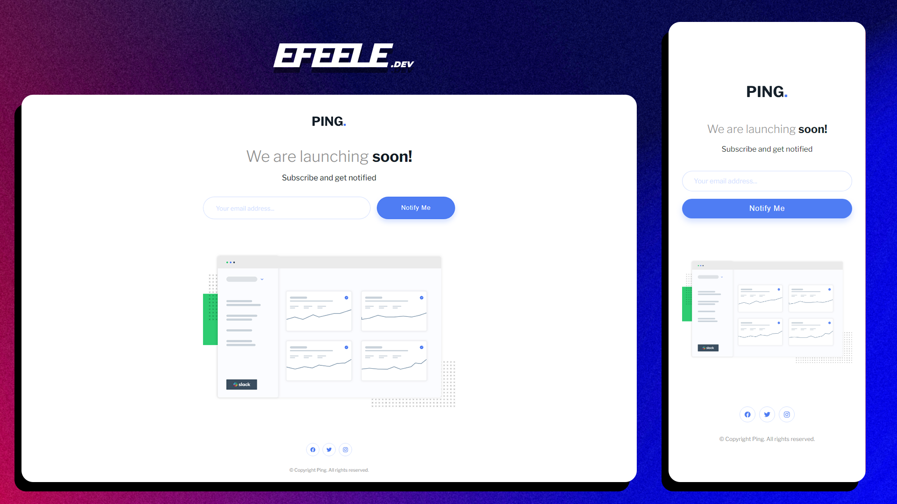

# Frontend Mentor - Ping coming soon page solution 🚀 (JS vanila)

This is a solution to the [Ping coming soon page challenge on Frontend Mentor](https://www.frontendmentor.io/challenges/ping-single-column-coming-soon-page-5cadd051fec04111f7b848da). Frontend Mentor challenges help you improve your coding skills by building realistic projects. 

## Table of contents

- [Overview 🔎](#overview)
  - [The challenge 🚀](#the-challenge)
  - [Screenshot 🖼️](#screenshot)
  - [Links 🌐](#links)
- [My process 🚝](#my-process)
  - [Built with 🛠️](#built-with)
  - [Continued development 👨‍💻](#continued-development)
  - [Useful resources 🧰](#useful-resources)
- [Author 😎](#author)

## Overview

### The challenge

Users should be able to:

- View the optimal layout for the site depending on their device's screen size
- See hover states for all interactive elements on the page
- Submit their email address using an `input` field
- Receive an error message when the `form` is submitted if:
	- The `input` field is empty. The message for this error should say *"Whoops! It looks like you forgot to add your email"*
	- The email address is not formatted correctly (i.e. a correct email address should have this structure: `name@host.tld`). The message for this error should say *"Please provide a valid email address"*

### Screenshot

### Links

- Solution URL: [frontendmentor.io](https://www.frontendmentor.io/solutions/ping-coming-soon-page-NLuudgh3RR)
- Live Site URL: [efeele.github.io](https://efeele.github.io/Ping-single-column-coming-soon-page/)

## My process

### Built with

- Semantic **HTML5** markup
- **CSS** custom properties
- Flexbox
- **JS** Vanilla
- [ionicons](https://ionicons.com/) - Icon library

### Continued development

I want to improve in the following areas for my next projects:
- **Responsive Design**
- **Semantic HTML5 markup**

### Useful resources

- [RegEx email 📧](https://regex101.com/library/SOgUIV) - This helped me to validate the email format.

## Author

- Website - [EFEELE](https://www.efeele.dev)
- Frontend Mentor - [@EFEELE](https://www.frontendmentor.io/profile/EFEELE)
- Youtube - [@efeeledev](https://www.youtube.com/@efeeledev)

